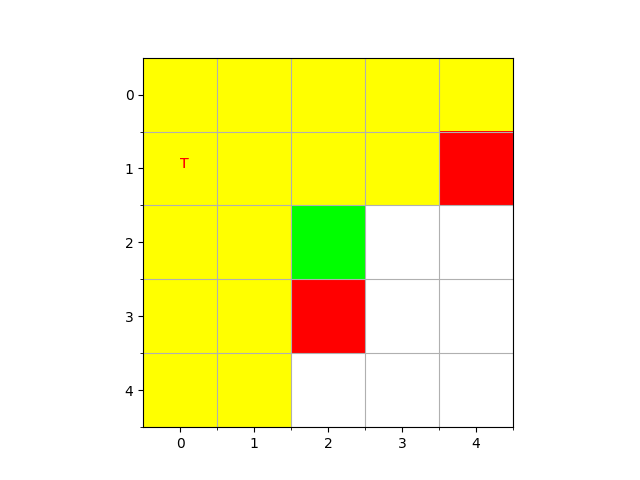

# Coding_Challenge

## Task 1:
Install python==3.8.0
### Instructions to run:
```
cd Task_1
pip install -r requirements.txt
python Task1.py
```

### Result:
For Task 1, the results are printed on the terminal and grids are visualised with required results.




## Task 2:
### Traditional method:

### Instructions to run:
```
cd Task_2/traditional
pip install -r requirements_traditonal.txt
python traditional.py
```

### Result:
For task 2 traditional, the results are stored in Coding_Challenge/Task_2/traditional/results folder
Results include Video and .csv file in required format

### DL Based Method:
Instructions to run:

```
cd Task_2/dl_based/yolov5
pip install -r requirements.txt
cd ..
python run_yolo.py
```
### Result:
For task 2 Deep Learning based, the results are stored in Coding_Challenge/Task_2/dl_based/yolov5/runs/detect/exp folder
Results include Video and .csv file in required format (in labels folder)
